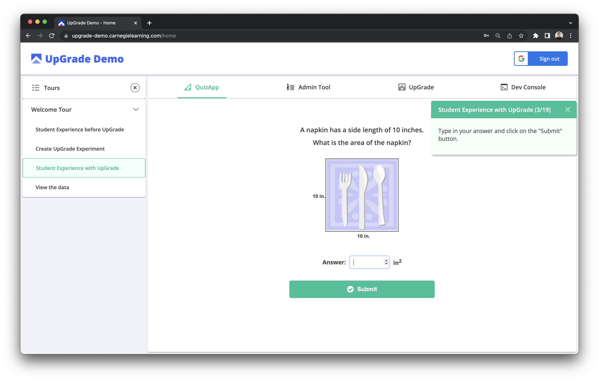

# UpGrade Demo App


## Description
An app to demonstrate UpGrade, an open-source platform to support large-scale A/B testing in educational applications. Learn more at www.upgradeplatform.org

## Setup

### Prerequisites
- Node.js installed on your system
- (Optional) Docker installed on your system
- (Optional) Make utility installed on your system

### Traditional Setup
1. Setup [UpGrade](https://github.com/CarnegieLearningWeb/UpGrade) following this [guide](https://upgrade-platform.gitbook.io/upgrade-documentation/hosting) and run the backend and frontend applications.
2. Run the following commands in the Terminal:
```
git clone https://github.com/CarnegieLearningWeb/upgrade-demo-app.git
cd upgrade-demo-app
touch .env
```
3. Open the `.env` file with an editor and add the following variables:
```
PORT=8080
MODE={DEV for development, PROD for production}
MONGODB_URI={MongoDB Connection String starting with mongodb+srv://}
GOOGLE_CLIENT_ID={Google OAuth 2.0 Client ID}
UPGRADE_HOST_URL={UpGrade Backend Host URL (e.g. http://localhost:3030)}
UPGRADE_BASE_URL={UpGrade Frontend Base URL (e.g. http://localhost:4200)}
UPGRADE_CONTEXT={Name of the UpGrade Experiment Context (e.g. app)}
UPGRADE_SERVICE_ACCOUNT_KEY_PATH={Path to the UpGrade Service Account Key File}
```
4. Run the following commands in the Terminal:
```
npm install
npm start
```
5. Open your web browser and navigate to http://localhost:8080

### Docker Setup
1. Follow steps 1-3 from the Traditional Setup to clone the repository and create the `.env` file.
2. Build and run the Docker container:
```
make up
```
3. Open your web browser and navigate to http://localhost:8080

### Make Commands
- Build the Docker image: `make build`
- Run the Docker container: `make run`
- Build and run the Docker container: `make up`
- Stop the Docker container: `make down`
- Stop and remove all Docker containers and volumes: `make clean`
- Show Docker container logs: `make logs`

You can also set the PORT and MODE environment variables when using make commands:
```
PORT=3000 MODE=DEV make up
```
