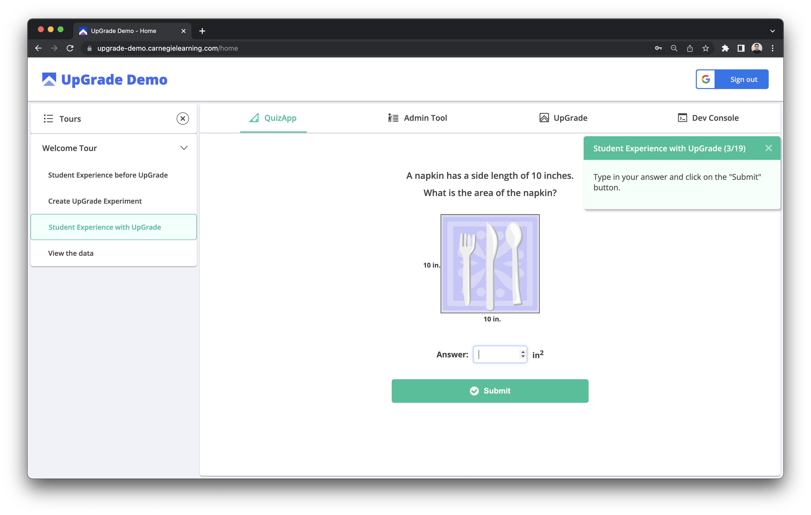

# UpGrade Demo App


## Description
An app to demonstrate UpGrade, an open-source platform to support large-scale A/B testing in educational applications. Learn more at www.upgradeplatform.org

## Setup

### Prerequisites
- Node.js installed on your system
- (Optional) Docker installed on your system
- (Optional) Make utility installed on your system

### Traditional Setup
1. Setup [UpGrade](https://github.com/CarnegieLearningWeb/UpGrade) following this [guide](https://upgrade-platform.gitbook.io/upgrade-documentation/hosting) and run the backend and frontend applications.
2. Run the following commands in the Terminal:
```
git clone https://github.com/CarnegieLearningWeb/upgrade-demo-app.git
cd upgrade-demo-app
cp .env.example .env
```
3. Open `.env` with an editor and fill in the values from `.env.example`.
4. Run the following commands in the Terminal:
```
npm install
npm start
```
5. Open your web browser and navigate to http://localhost:8080

The deployed app also serves protected external tools from the same process:
- Problem Authoring Tool: http://localhost:8080/problem-authoring-tool/
- AI Experiment Consultant: http://localhost:8080/ai-consultant/

### Syncing External Apps
This repository vendors the server files and built client bundles for the sibling `problem-authoring-tool` and `upgrade-consultant` projects. After changing either external app, run this from the `upgrade-demo-app` root to refresh the vendored copies:
```
./sync-external-apps.sh
```

If the external app client bundles need to be rebuilt first, run:
```
./sync-external-apps.sh --build
```

The script assumes the sibling repositories live next to `upgrade-demo-app` in the same parent directory. You can override the paths with `PAT_ROOT=/path/to/problem-authoring-tool` or `CONSULTANT_ROOT=/path/to/upgrade-consultant`.

### Docker Setup
1. Follow steps 1-3 from the Traditional Setup to clone the repository and create the `.env` file.
2. Build and run the Docker container:
```
make up
```
3. Open your web browser and navigate to http://localhost:8080

### Make Commands
- Build the Docker image: `make build`
- Run the Docker container: `make run`
- Build and run the Docker container: `make up`
- Stop the Docker container: `make down`
- Stop and remove all Docker containers and volumes: `make clean`
- Show Docker container logs: `make logs`

You can also set the PORT and MODE environment variables when using make commands:
```
PORT=3000 MODE=DEV make up
```
